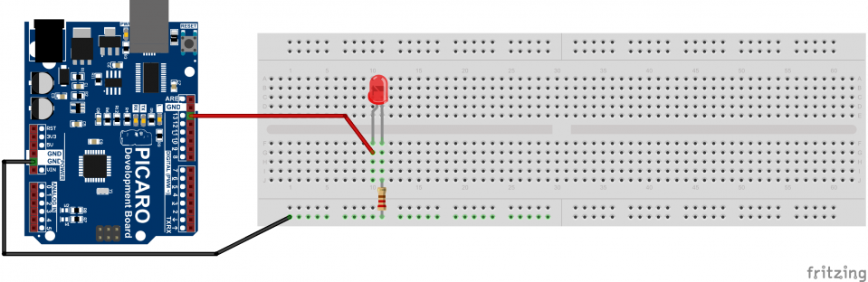

# blink

## Motivation

Use Arduino Board to make a led blink.

## Run Locally

### Diagram



### Execution

```bash
RAVEDUDE_PORT=/dev/tty.usbserial-1410 cargo r --bin blink
```

> **Info** The value `RAVEDUDE_PORT` is likely to differ for your system
> you can use the `/bin/ravedude_port.sh` script to detect your device port.
